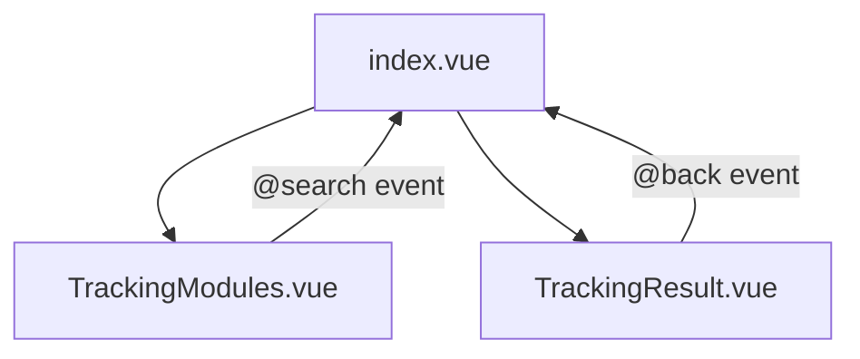

# AI Order Tracking Modules 技术文档

## 1. 整体架构

### 1.1 组件关系


### 1.2 功能职责
- `index.vue`: 主容器组件，负责整体布局和状态管理
- `TrackingModules.vue`: 模块选择和搜索组件
- `TrackingResult.vue`: 结果展示组件

## 2. TrackingModules.vue 组件详解

### 2.1 核心功能
- 提供模块化的功能选择界面
- 集成搜索功能
- 实时系统状态展示

### 2.2 组件结构
```vue
- 标题区域 (title-section)
  - 搜索区域 (search-section)
  - 模块标题 (module-title)
- 模块选择区域 (module-grid)
- 实时状态面板 (dashboard-section)
```

### 2.3 数据模型
```typescript
interface TrackingModule {
  id: string
  title: string
  icon: string
  description: string
  placeholder: string
}
```

### 2.4 可用模块
1. 订单信息 (Order Information)
2. 产品信息 (Product Information)
3. 库存状态 (Inventory Status)
4. 出库追踪 (Outbound Tracking)
5. 包裹信息 (Package Information)
6. 物流追踪 (Logistics Tracking)

### 2.5 状态管理
```typescript
const selectedModule = ref<TrackingModule | null>(null)
const searchQuery = ref('')
const showDashboard = ref(true)
```

### 2.6 事件处理
```typescript
// 模块选择
const selectModule = (module: TrackingModule) => {
  selectedModule.value = module
  searchQuery.value = ''
}

// 搜索处理
const handleSearch = () => {
  if (!searchQuery.value) return
  emit('search', {
    module: selectedModule.value?.id || 'fullchain',
    query: searchQuery.value
  })
}
```

## 3. index.vue 组件详解

### 3.1 核心功能
- 页面整体布局管理
- 状态控制和数据流转
- 背景动画效果
- API 调用和数据处理

### 3.2 组件结构
```vue
- 背景元素 (tech-background)
  - 网格覆盖层 (grid-overlay)
  - 浮动粒子 (floating-particles)
  - 发光圆圈 (glow-circle)
- 搜索区域 (search-section)
  - 欢迎文本 (welcome-text)
  - TrackingModules 组件
- 结果区域 (result-section)
  - TrackingResult 组件
```

### 3.3 状态管理
```typescript
const trackingData = ref<any>(null)
const hasResult = computed(() => !!trackingData.value)
```

### 3.4 数据流转
1. 用户在 TrackingModules 中搜索
2. 触发 `handleModuleSearch` 事件
3. 调用 API 获取数据
4. 更新 trackingData
5. 显示 TrackingResult 组件

### 3.5 API 响应数据结构
```typescript
interface TrackingResponse {
  orderNo: string
  status: string
  updateTime: string
  delayRisk: boolean
  splitFulfillment: boolean
  items: Array<{
    sku: string
    name: string
    image: string
    specs: Record<string, string>
    quantity: number
    price: number
  }>
  subtotal: number
  shipping: number
  tax: number
  total: number
  fulfillmentOrders: Array<{
    id: string
    warehouse: string
    location: string
    status: string
    steps: Array<{
      name: string
      completed: boolean
      time: string
    }>
  }>
  packages: Array<{
    carrier: string
    trackingNo: string
    status: string
    events: Array<{
      time: string
      location: string
      description: string
      current: boolean
      meta?: Array<{
        label: string
        value: string
        type: string
      }>
    }>
  }>
}
```

## 4. 样式设计

### 4.1 主题配色
- 主背景：`linear-gradient(135deg, #1a1f35 0%, #131b2e 100%)`
- 主要强调色：`#4285f4`
- 次要强调色：`#34a853`
- 文本颜色：
  - 主要文本：`#ffffff`
  - 次要文本：`rgba(255, 255, 255, 0.7)`

### 4.2 动画效果
1. 网格移动动画 (gridMove)
2. 粒子浮动动画 (particleFloat)
3. 发光脉冲动画 (glowPulse)
4. 标题发光动画 (titleGlow)

### 4.3 响应式设计
- 桌面端：最大宽度 1200px
- 平板端：模块网格调整为两列
- 移动端：模块网格调整为单列

## 5. 最佳实践

### 5.1 性能优化
1. 使用 computed 属性计算派生状态
2. 组件懒加载
3. 事件节流和防抖
4. 使用 CSS transform 实现动画

### 5.2 代码组织
1. 类型定义清晰
2. 组件职责单一
3. 事件命名规范
4. 样式模块化

### 5.3 用户体验
1. 加载状态反馈
2. 错误处理和提示
3. 平滑的动画过渡
4. 直观的模块导航

## 6. 扩展建议

### 6.1 功能扩展
1. 添加更多跟踪模块
2. 集成实时数据更新
3. 添加数据导出功能
4. 支持多语言

### 6.2 性能优化
1. 实现虚拟滚动
2. 添加数据缓存
3. 优化动画性能
4. 实现预加载

### 6.3 用户体验提升
1. 添加快捷键支持
2. 优化移动端体验
3. 添加主题切换
4. 支持自定义布局 